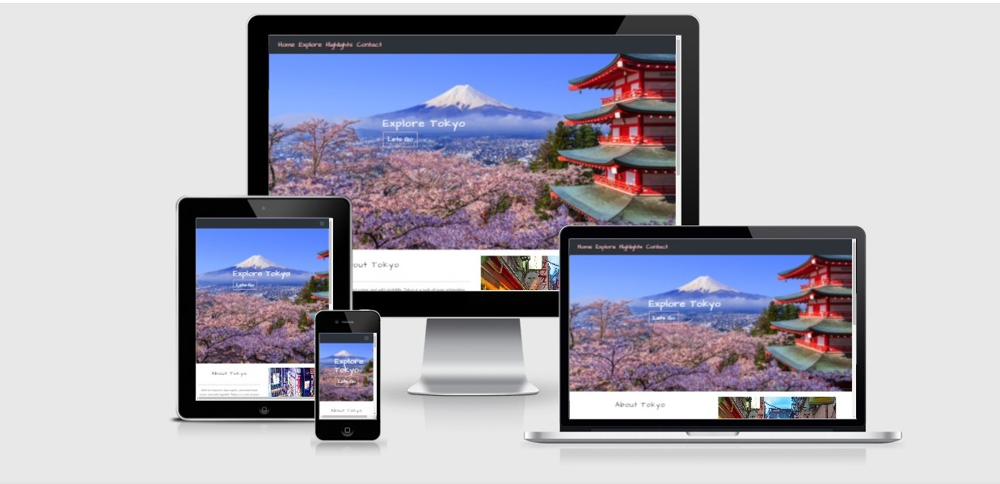
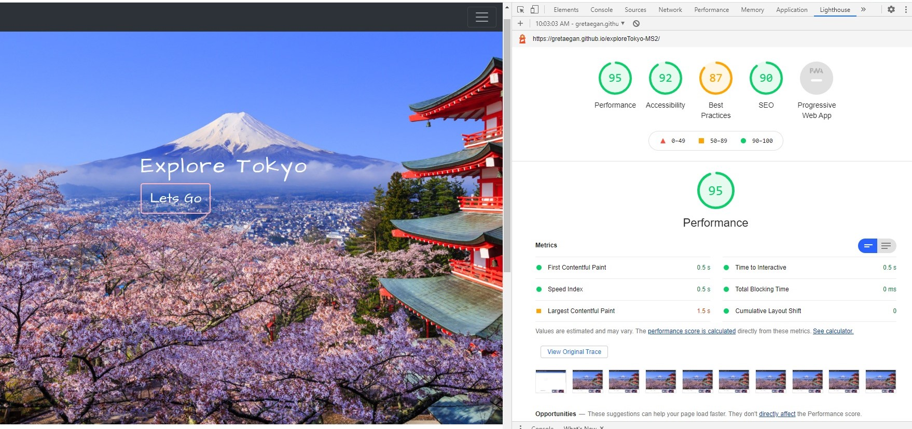
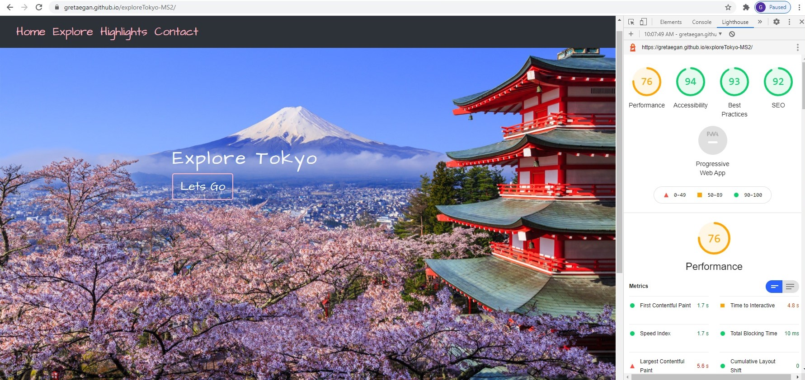

# Explore Tokyo

This website is my second Milestone Project on the Code Institute Full Stack Web Developer Course.

My project is a travel website about Tokyo, Japan. It is my second Milestone project on the Code Institute Full Stack Software Developer course.  I chose this project because I have travelled to Tokyo many, many times and I hope that, by looking at my website, others
will feel the same excitment to travel to Tokyo that I felt the first time that I visited. I feel this website is useful as a travel website, it is concise and 
clear on its objective. The website is designed for both mobile and desktop, so that users can access it from any devise and find information easily no matter what device 
they are using. I created this website as if a fictional travel company had written it, so the site reads like it is used by a tour company. 
the live site can be found [here](https://gretaegan.github.io/exploreTokyo-MS2/)

# UX
## User Stories 

*Who is this website targeting?*

This website is to provide information to first time visitors, and also to previous visitors to Tokyo. It is targeting both solo tourists and tourists who wish to avail 
of the option of joining a group tour. 

*As a first-time user of this website, I want*

1. To understand the brand at first glance, and to see what the company is offering.

1. To see highlights of Tokyo and see pictures of what the city can offer a tourist . To be inspired to book a trip.

1. To find information about Tokyo presented in a concise and easy to read manner. To get a feel for Tokyo just by looking at the site.

1. To be able to look up various hospitality and find recommendations on a Google map .

1. To be able to contact the travel company easily via a contact form.

*As a returning user of this website, I want*

1. To find the website functioning. To be able to come back and use the map to locate various hospitality.

1. To be able to contact the travel company without any issues. To find the contact form functioning and to find the company's details easily.

*As the business owner, I want*

1. A website that showcases the product and inspires the user to want to travel. To show the best of Tokyo and to make the user want to book a trip.

1. For users to be able to contact me without any problems. The site should be functioning at all times and easy to use.

# Design

### Images Used
.

* The images I used for this project were sourced from Google and have been referenced in the content section of this Readme.

* I wanted images to show both the city aspect of Tokyo, the neon lights and skyscrapers and crowds, and also the cherry blossoms, national parks and shrines.
I feel it was important to show both aspects of Tokyo to inspire potential visitors. 
I used the colors: #FFB6C1 (light pink), #2C3237da (lighter gray) and #2C3237 (dark gray) mostly. 

* I included a carousel on the main page to showcase three main highlights of Tokyo, the Golden Gai area of Shinjuku, the famous Shibuya crossing and a shot of the 
Imperial palace against the skyscrapers of Tokyo. 

### Typography

* I have used the fonts 'Architects Daughter' and 'Raleway' in this project. I wanted to convay a feeling of casual professionalism and also to use a font that I felt was
fitting with the Japanese theme of the site.
 Architects Daughter is the perfect amount of casual and artistic and I think it has captured the feel of the site well. 
Raleway is a font that is both professional looking and casual so I have used it for all minor headings and information paragraphs and am pleased with the look it convays.
 

### Layout

* Explore Tokyo is a website that uses multiple pages for ease of navigation. I have provided a simple Navbar with a fixed top, so that the user finds it easy to navigate the 
various pages on the website and also doesnt get lost when browsing the site. 

* I used to Bootstrap grid system to provide the layout of the website and to ensure responsiveness on both mobile and desktop devices.

* The navigation bar at the top of the page is fixed and, on smaller screen sizes, becomes a data toggler button to prevent cluttering the screen. 

* The About section is informative and provides a basic knowledge of Tokyo. Beside it, is a carousel of three images that showcase three different aspects of Tokyo 
that will encourage users to want to travel.

* The Explore page is the main interactive page of the website. It shows the three main areas to travel in Tokyo, Shinjuku, Shibuya and Asakusa. These were chosen because, 
from my own extensive experience, they are the best areas to stay in for nightlife, shopping and culture, all things that I feel are extremely important to a tourist.

* The Highlights page is a simple page where users can see the main attractions in Tokyo by picture, and a short paragraph of information about each place.
The information is hidden initially but when the user hovers their mouse over the picture, the information will show. I feel that this will encourage users to travel 
by showcasing the best that Tokyo has to offer. Users can expect to find these attractions in their hypothetical itinerary. 

* The Contact page is where the user goes to request more information, to request a brochure, or to contact the company of the website. The contact page is clear, concise
and simply decorated to detract from any confusion. I have used EmailJS to make the page responsive, when a user leaves their details in the contact form I recieve an 
email with the details of the user.

### Colors 

* The colors I have used in this website have been chosen because I wanted to fit in with the theme of cherry blossoms. When people think of Tokyo they are initially 
drawn to an image of a busy city, but I wanted to show the side of Tokyo that is more nature-focused and filled with beautiful pink flowers. 
I have used a dark colored navbar because I feel like it compliments the site well and provides a professional feel. 

* I chose a Hero image that shows a picture of every side of Tokyo that I want to show - a temple, a city and cherry blossoms. I felt it was important to not focus on the 
city side of Tokyo as it might discourage visitors who do not enjoy a city break.

### Overall Feel

Overall I wanted this website to show the many sides of Tokyo that I have learned of myself, the busy city side, the ancient shrines and temples and the beautiful nature of cherry blossom trees and 
national gardens. I think that by including the chosen images, by using the pink based color schemes and by the presentation of my information I have done that. 
The feel of the site is both informative and professional and information is easy to access. The company is easily contacted and navigation is simple and easy. 

# Wireframes

I used Figma for creating the wireframes for this project.

The link to my wireframes can be found [here](https://www.figma.com/files/project/23855516/Milestone-project2)

# Features

* Explore Tokyo is a mobile first, responsive website. I have used Bootstrap 5 to make the website fully responsive. 

* The Navigation bar list items become hidden in a data-toggler on smaller screen sizes.

* The social media icons link to their respective websites.

* The Explore page area images show information about each respective area on clicking.

* The Google Map API provides information about restaurants, bars and hotels once the user clicks on a button. 

* The user can see information and a marker for each hospitality recommendation on the Google Map via an info window.

* The contact form is fully responsive and, when filled in, sends an email requesting information to my own email address in lieu of the company.

* I have used a Bootstrap Carousel on the home page to show highlights of Tokyo in a modern and dynamic way.

## Technologies Used

* HTML5
* CSS3
* Javascript
* JQuery 

## Frameworks Used

*JQuery was used to write some of my code.
* Google Maps API was used to provide the map element and also the Places library which showed information on hospitality.
* EmailJS which was used to provide a responsive contact form. 
* Bootstrap was used to provide the website layout, features including the Navbar and data toggler, and to make the site responsive.
* Font Awesome was used to provide the icons in the training section and the testamonial section.
* Google Fonts was used to provide the font used across the entire webpage.
* Figma was used to provide the wireframes for the project.
* GitHub was used to host the repository.
* GitPod was used to develop the project.
* GitHub pages was used to deploy the project.
* Lighthouse was used to check performance.
 

# Testing with Code Validators

I used the code validators :

* HTML - https://validator.w3.org/
* CSS - https://jigsaw.w3.org/css-validator/
* JS Hint - https://jshint.com/

Results: 

* HTML Results can be found [here](https://validator.w3.org/nu/?doc=https%3A%2F%2Fgretaegan.github.io%2FexploreTokyo-MS2%2F)
- There is a warning about section headings in my footer. I do not feel a heading is relevant to my footer so I have added it for screen readers only.

* CSS Results can be found [here](https://jigsaw.w3.org/css-validator/validator?uri=https%3A%2F%2Fgretaegan.github.io%2FexploreTokyo-MS2%2F&profile=css3svg&usermedium=all&warning=1&vextwarning=&lang=en)
  The results indicate several warnings and errors, however they are within the Bootstrap files and not my own CSS so I am happy that my own CSS code has no issues. 

* I used JS Hint throughout my project while coding, to check for errors in my code as I wrote it. Any issues found were minor and contained to missing semi-colons and 
  syntax problems. I was able to use this method to make sure there were no issues with my Javascript code throughout the project. 

## Testing User Stories

From the UX Section: 

*To understand the brand at a first glance*
* I have achieved this by using a mixture of relevant images, clear captions and informative sections to show clear information about Tokyo. 

*To understand what the product being sold is*
* The product is easily understood by the what we offer section on the main page. It shows the types of holiday packages on offer and gives a clear link to the 
contact form where users can request more information and expect to begin their holiday planning.

*To be able to look up various hospitality and find recommendations on a Google map*

* I have used the Google places library to provide recommendations based on the locations. This is easily accessed by the various buttons  that I have used. The user
simply clicks on a button and the various recommendations are shown on the map.

*To be able to contact the travel company easily via a contact form

* The contact page is both simply presented to the user and responsive. This has achieved my goal of making the company easily contactable. The user simply needs to fill 
out the contact form and the company (me) recieves an email to say the user is requesting more information.

*Has this website succeeded in providing clear information on travelling to Tokyo to potential customers?*
* I am happy that my website has succeed in providing inspiration and information for any potential users. It is informative, simple and there is a means for users 
to contact the company without any issues. 
 

## Further Testing

* Lighthouse was used to test the performance of my site on both mobile and desktop. 

 

 * On desktop, I am very happy with these results. 

 * On mobile, performance is not as good as I would like. This could be improved in future by implementing a splash screen.

 Overall I am happy with the results from Lighthouse.

 * This project has been tested on various devices such as :
  - iPhone 8
  - iPhone XR
  - Samsung Galaxy A51
  - iPad Pro 
  - Dell G7
  - Macbook Air 13'  

 ## Bugs

 * There was an issue with the home page showing a large amount of white space to the right when being used on smaller screens such as mobile phones.
 This was resolved by adding the g-0 class to the hero image and removing all unneccesary padding.

 * The contact form was giving a 400 Bad Request error in the console when I tested it. Eventually this was resolved by using a different service ID in my template on 
  EmailJS website.

  * The navbar toggler was not working as intended initially, this was resolved by updating the code to use Bootstrap 5 as opposed to older versions that I had previously used.

  * There was an issue with my JS code for the Google Map. The latitude in my explore data array was not being read, and showing in my console as undefined. 
  This was eventually solved by using a deconstructed array to declare my latitude and longitude variables. 
 

## Resources

* Code Institute Course content - I learned so much from the content of the CI course and it provided inspiration and a lot of fundamental ideas for this project. My 
EmailJS section was heavily referenced from the Rosie Project in the Interactive Frontend Development module of the course. 
* Code Institute Slack community - Without the help and experiences of this community I would have not been able to solve many of the issues I had with coding this project. 
* Google Chrome Developer Tools - DevTools provided endless help in finding busgs in my code, and testing my code via the console and Lighthouse. 
* [Google Maps API documentation](https://developers.google.com/maps/documentation/javascript/overview) and [Google Places Library](https://developers.google.com/maps/documentation/javascript/places)- I have referenced all code help and code used in my map.js file. The documentation was heavily referenced and relied on to complete this 
project. 
* [EmailJS](https://www.emailjs.com/) documentation- I referenced this while writing the code to make my contact page interactive. 
* [Stackoverflow](https://stackoverflow.com/)- All code help and code that was sourced from Stack Overflow has been refereneced in comments in my code throughout this project. It was namely used for 
 help with getting the Google Map to center when clicking on a button. 
* [Bootstrap](https://getbootstrap.com/docs/5.0/getting-started/introduction/) documentation was referenced for the Navbar and the Carousel on the home page. 
* [W3Schools](https://www.w3schools.com/) - I often relied on W3 Schools website to gain a better understanding of using CSS to lay out my website, namely making my buttons vertically aligned on the 
  Explore page. 
* [Font Awesome](https://fontawesome.com/) was used to provide the icons used throughout this project. 
* [JQuery](https://jquery.com/) was used to make writing my Javascript code simplier.
* [Figma](https://www.figma.com/) to create the wireframes for this project. 
* [Tripadvisor](https://www.tripadvisor.ie/) for information on various attractions in Tokyo. 

# Deployment 

This site was deployed through GitHub Pages. The steps I took to deploy were as follows.
1. Log into GitHub.
1. Locate the repository.
1. Locate the settings option along the options bar.
1. Locate GitHub Pages options towards the bottom of the page.
1. In 'Source' dropdown, select 'Master' from the branch options.
1. Click the save button.
1. The site is now published and it was accessable after a few minutes.
1. The site URL is visable on the green bar under the section header. This will remain there permanently and it can be referred back to at any time.

## Cloning
1. Log into GitHub.
1. Locate the repository.
1. Click the 'Code' dropdown above the file list.
1. Copy the URL for the repository.
1. Open Git Bash on your device.
1. Change the current working directory to the location where you want the cloned directory.
1. Type git clone in the CLI and then paste the URL you copied earlier. This is what it should look like: $ git clone
https://github.com/gretaegan/exploreTokyo-MS2.git
1. Press Enter to create your local clone.

# Credits 

## Content
* Content was mainly written by myself. Any code that was not my own has been referenced in comments and has been included in the Resources section of this READMe.
* Google Maps API documentation provided most of the help and reference for my JS Code.
* Bootstrap for my carousel and navbar.
* EmailJS and the course content for my contact form.
* Photos from this project were sourced from Google and in particular:
- "Akihabara" - www.lonelyplanet.com
- "Asakusa-Sensoji" - www.jw-webmagazine.com
- "Golden Gai" - www.byfood.com 
- "Imperial palace" - www.japanistry.com 
- "Japan hero" - www.isipionline.it 
- "Meiji" - www.old.tokyo.info 
- "Shibuya pic" - www.wikimedia.org 
- "Shibuya crossing" - www.blog.airpaz.com 
- "Shinjuku Gyoen" - www.pinterest.com 
- "Shinjuku" - www.sojurnermoxie.com 
- "Skytree" - www.wikipedia.com 
- "Takeshita" - www.scoopnest.com 
- "Tokyo Blossoms" - www.japancherryblossom.com 

# Acknowledgements 
* To my mentor Oulawafemi Medale for his guidance and help with my project, and for his endless patience. 
* To the tutor support team who helped me to find the solutions to problems I had while coding this project. 
* To the entire Slack community for providing help when I needed it, no matter how silly my questions seemed. 
* To my cohort, the Springboard September 2020 group who have been an endless source of help, advice and laughs. 
* To my family for putting up with my constant talking about my project and requests for coffee. 
* To Code Institute for providing such an informative and exciting course that has brought me from zero coding experience, to completing this project. 
